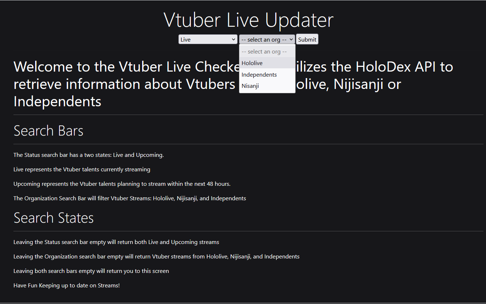
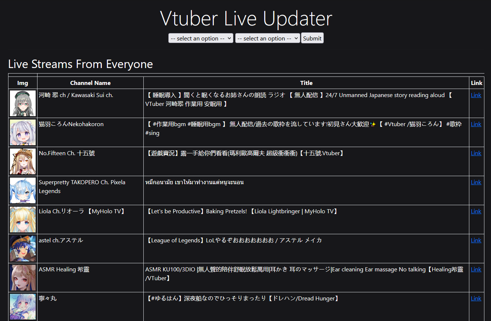

# HoloTracker

HoloTracker is a project I created during my spare time to allow users to see if their favorite Vtuber is currently streaming or not. The project was created using C# with ASP.NET using MVC. I cannot get the website to run on GitHub pages so if you would like to see the project in action, please download or fork the project here to run it locally on your machine.
Check out the Holodex API [Here](https://docs.holodex.net/)

Intro
---
Welcome to the Vtuber Live Checker. This utilizes the HoloDex API to retrieve information about Vtubers from Hololive, Nijisanji or Independents
Search Bars

Filtering The Search:
---
The website utilizes two search bars, Status and Organization. In the first example I am selecting Live and Hololive. This sends a query to return Vtubers from Hololive who are currently streaming. Below are examples of how the Search Bars (Status and Organization) can be used.

**Leaving BOTH search bars empty will not return Live and Upcoming streams from all organizations**

The results of the previous query is shown here

Filter using Only Organization:
---
If the user only fills out the Organization Search Bar, the query will return BOTH Live and Upcoming streams from that organization

The results of the previous query is shown here

Filtering using Only Status:
---
If the user only fills out the Status Search Bar, the query will return streams from ALL organizations (Hololive, Nijisanji, Independents)

The results of the previous query is shown here

